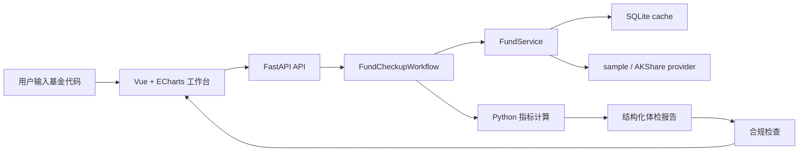

# FundScope Agent

FundScope Agent 是一个基金研究与风险分析 Agent 项目，目标是帮助普通投资者看懂基金的历史表现、回撤风险和适合人群，而不是替用户做买入或卖出决策。

当前版本是作品展示级 MVP：输入基金代码后，系统会获取基金档案和历史净值，使用 Python 计算核心风险收益指标，并生成一份结构化基金体检报告。报告会经过合规检查，避免出现“稳赚”“保证收益”“强烈推荐买入”等不合规表述。

> 仅供研究参考，不构成投资建议。基金有风险，投资需谨慎。

## 项目背景

很多普通用户选择基金时只看短期涨幅、排行榜或他人推荐，但很少能系统判断：

- 收益是否来自长期能力，还是短期风口。
- 历史最大回撤有多深，是否能承受。
- 波动率和夏普比率是否匹配收益表现。
- 当前基金更适合稳健观察，还是只适合高风险用户。
- 报告中的结论是否有清晰数据依据和风险提示。

FundScope Agent 将这些分析流程产品化：确定性代码负责数据、指标和底线判断，Agent 工作流负责组织分析步骤，前端工作台负责可视化展示。

## 核心功能

已实现：

- 基金搜索入口：`GET /api/funds/search?q=110011`
- 基金基础档案：名称、代码、类型、成立时间、基金经理、基金公司、规模、申赎状态等。
- 历史净值数据：单位净值、累计净值时间序列。
- 风险收益指标：累计收益、年化收益、年化波动率、最大回撤、夏普比率、卡玛比率、胜率、阶段收益。
- 回撤分析：最大回撤起点、谷底、修复天数和回撤曲线。
- 基金体检报告：结论、摘要、风险提示、适合人群、不适合人群、数据说明、合规提示。
- 合规检查：自动拦截或改写不合规投资建议话术。
- Vue 工作台：基金输入、指标卡片、净值曲线、累计收益曲线、回撤曲线和右侧报告面板。
- SQLite 缓存：按数据源命名空间缓存基金档案和净值，避免重复请求。
- AKShare 真实数据：默认使用 AKShare 获取基金档案、单位/累计净值、持仓、行业配置和费率；失败时 fallback 到 sample。
- 百炼模型连接测试：通过 OpenAI-compatible SDK 测试 `deepseek-v4-flash` 服务可用性。

规划中：

- 用户风险画像。
- 多基金对比。
- 持仓、行业集中度和风格漂移分析。
- 定投回测。
- 公告/季报 RAG。
- Memory 保存用户关注列表、风险偏好和历史分析上下文。
- SSE 实时输出 Agent 分析进度。

## 技术栈

- Backend: FastAPI, Python, Pydantic, SQLite
- Metrics: Python 标准库，后续可扩展 Pandas / NumPy
- Data Providers: AKShare provider, sample fallback provider, Tushare 预留
- Agent Workflow: 当前为 LangGraph-compatible workflow wrapper，后续拆为显式 LangGraph 节点
- Frontend: Vue 3, Vite, TypeScript, ECharts, `@lucide/vue`
- Tests: pytest, Vue type check, Vite production build

## 架构概览



关键设计原则：

- 金融指标必须由确定性代码计算，不能让 LLM 直接算。
- Agent 只负责流程编排、解释生成和合规改写。
- 数据不足时降级为“数据不足，暂不评价”，不硬编结论。
- 默认走 AKShare 真实数据；公开接口失败时降级到 sample provider。

## 运行方式

### 后端

```bash
python3 -m venv venv
source venv/bin/activate
pip install -r requirements.txt
pytest
uvicorn app.main:app --app-dir backend --reload
```

默认使用 AKShare 真实数据，并在公开接口失败时降级到 sample 数据。强制使用 sample：

```bash
FUNDSCOPE_DATA_PROVIDER=sample uvicorn app.main:app --app-dir backend --reload
```

百炼模型连接测试需要配置：

```bash
DASHSCOPE_API_KEY=...
DASHSCOPE_BASE_URL=...
DASHSCOPE_MODEL=deepseek-v4-flash
```

`DASHSCOPE_BASE_URL` 请放在本地环境变量或部署环境中，不要写入仓库。

### 前端

```bash
cd frontend
npm install
npm run dev
```

打开：

```text
http://127.0.0.1:5173
```

### 验证

```bash
source venv/bin/activate
pytest
cd frontend
npm run build
```

## API 摘要

- `GET /api/health`
- `GET /api/funds/search?q=110011`
- `GET /api/funds/{code}/profile`
- `GET /api/funds/{code}/nav`
- `GET /api/funds/{code}/holdings`
- `GET /api/funds/{code}/industry-allocation`
- `GET /api/funds/{code}/fees`
- `POST /api/reports/fund-checkup`
- `GET /api/llm/health`

示例：

```bash
curl -X POST http://127.0.0.1:8000/api/reports/fund-checkup \
  -H "Content-Type: application/json" \
  -d '{"code":"110011"}'
```

完整接口说明见 [docs/API.md](docs/API.md)。

## 功能截图

当前截图占位：

```text
docs/assets/fundscope-workbench.png
```

截图应展示：

- 左侧功能导航。
- 基金搜索框。
- 指标卡片。
- 净值、累计收益、回撤图表。
- 右侧基金体检报告和合规提示。

## 技术亮点

- 将基金研究流程拆成 Provider、指标计算、报告生成、合规检查和 Agent 编排，职责边界清楚。
- 确定性指标计算与 LLM/Agent 职责解耦，避免模型幻觉影响金融计算。
- 内置合规词扫描和报告结论白名单，避免把研究辅助工具做成荐基工具。
- 默认 AKShare provider 支持真实数据，sample provider 作为稳定 fallback。
- 前端不是聊天壳，而是可视化研究工作台，更适合作品展示。
- 文档体系覆盖 PRD、架构、API、指标、合规和项目状态，方便长期维护和面试讲解。

## 后续规划

1. 将 `FundCheckupWorkflow` 拆成显式 LangGraph 节点：数据采集、指标计算、报告解释、合规检查。
2. 增加用户风险问卷，用风险画像影响报告结论。
3. 增加多基金对比和同类基金筛选。
4. 接入持仓、行业配置、基金经理和规模变化数据。
5. 加入定投回测和一次性买入对比。
6. 加入公告/季报 RAG，并在报告中显示引用来源。
7. 使用 SSE 输出分析进度，让用户看到数据采集、计算、报告生成和合规检查阶段。

## 简历描述

简洁版：

> 基于 FastAPI + Vue + LangGraph 设计基金研究与风险分析 Agent，支持基金搜索、历史净值分析、最大回撤/波动率/夏普比率等指标计算、结构化基金体检报告生成和合规话术检查，帮助普通用户理解基金风险收益特征而非直接荐基。

技术版：

> 设计 FundScope Agent 多层架构，将数据 Provider、确定性指标计算、Agent 工作流、报告生成和合规检查解耦；通过 Python 计算累计收益、年化波动率、最大回撤、夏普比率等指标，并在 FastAPI 中提供结构化报告 API，前端使用 Vue + ECharts 展示净值、收益和回撤曲线。系统内置结论白名单和禁用话术扫描，避免 LLM 参与金融计算或输出直接买卖建议。

## 数据与合规说明

开发阶段默认使用 AKShare provider，sample provider 仅作为 fallback。AKShare 仅用于学习、研究和作品演示探索，不适合作为商业化数据源。若项目未来公开运营或商业化，需要替换为合规授权数据源，并进行法律、合规和数据授权审查。
