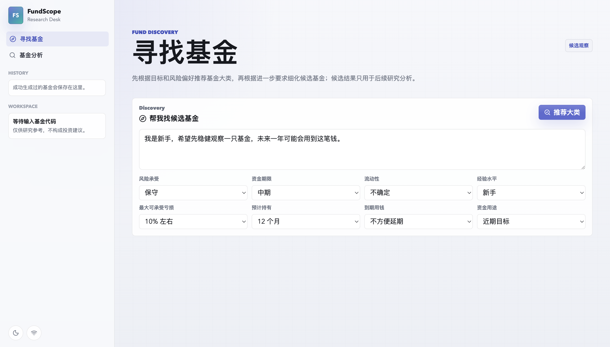
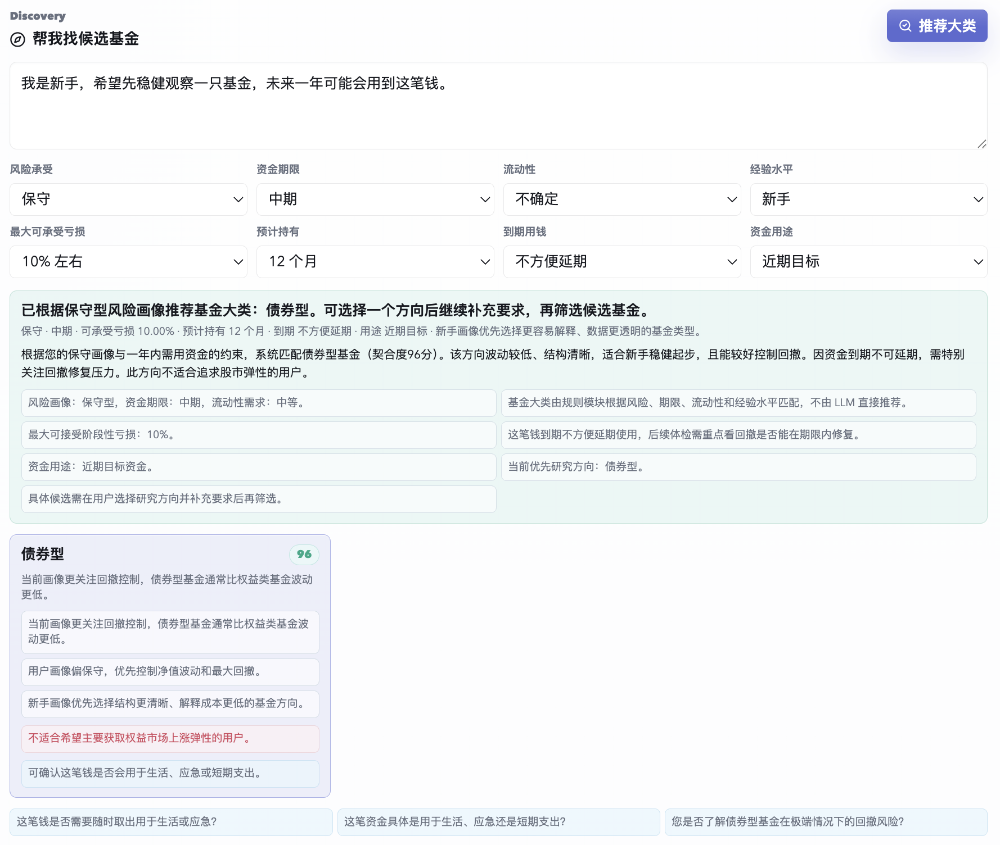
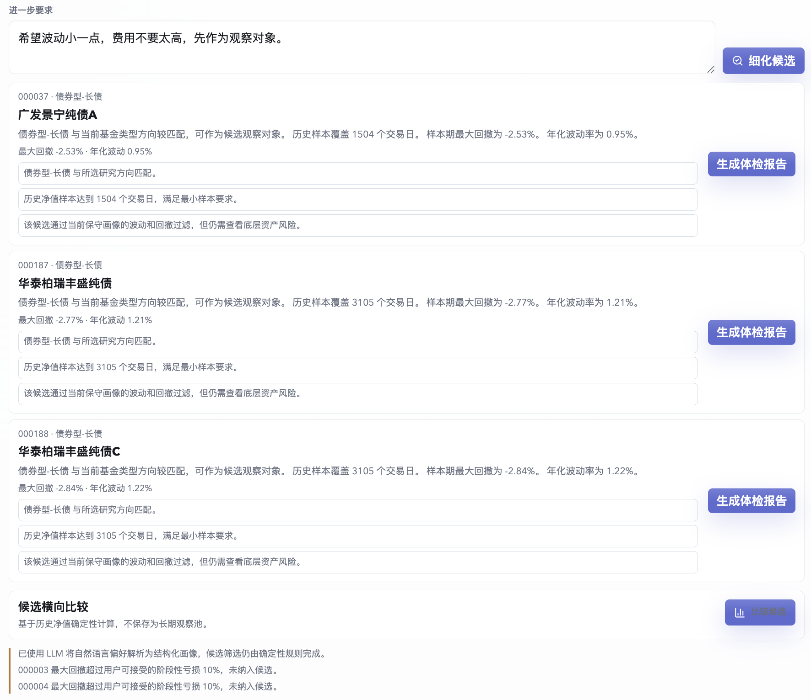
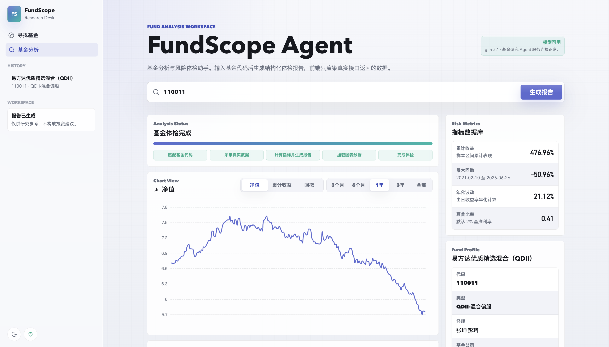
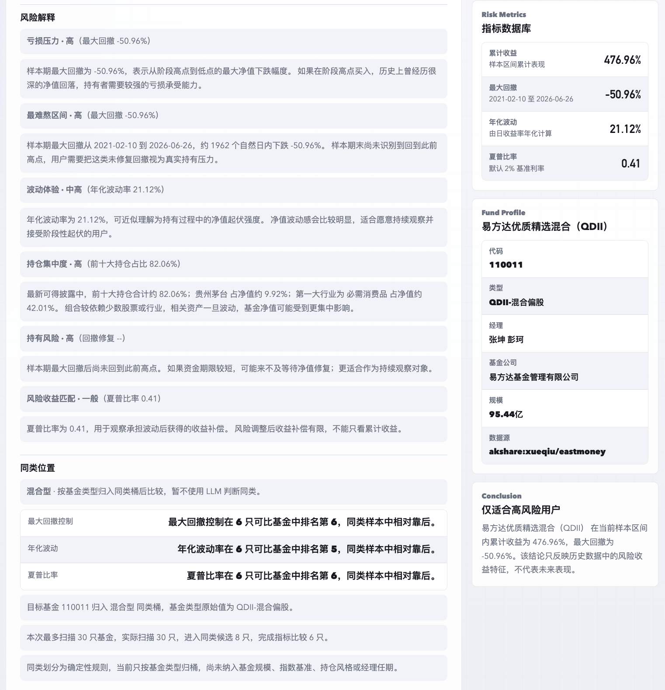
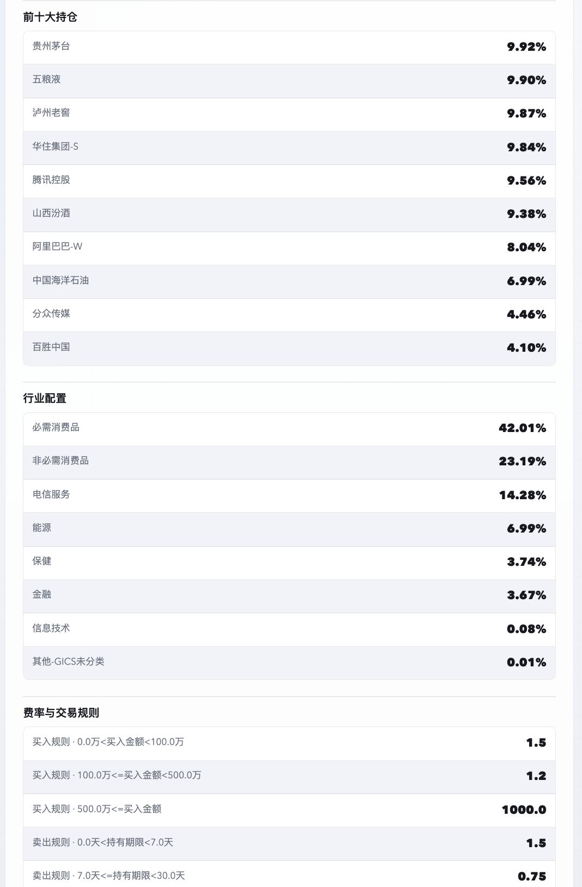
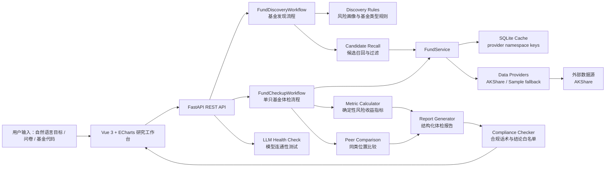

# FundScope Agent

FundScope Agent 是一个面向普通基金投资者的基金研究与风险体检工作台：通过基金发现、真实数据采集、确定性风险指标计算和合规化报告，帮助用户理解一只基金的历史收益、回撤压力、持仓暴露和适合观察边界。

> 仅供研究参考，不构成投资建议。基金有风险，投资需谨慎。

## 项目展示

### 1. 基金发现入口

用户还不知道具体基金代码时，先通过自然语言目标和风险偏好问卷确定研究方向。



### 2. 基金大类推荐与风险边界

系统先推荐基金大类，再解释匹配依据、风险边界和需要继续确认的问题，不直接给出买卖结论。



### 3. 进一步细化候选基金

用户选择基金大类后，可以补充“波动小、费用低、先观察”等进一步要求，系统再输出候选观察基金，并保留筛选依据和风险提示。



### 4. 单只基金分析工作台

输入基金代码后，前端展示生成进度、净值曲线、风险指标、基金档案和结构化报告。



### 5. 风险解释与同类位置

报告将最大回撤、波动率、夏普比率、持仓集中度等指标翻译成普通用户能理解的风险说明。



### 6. 持仓、行业配置与费率规则

除净值指标外，系统还展示持仓、行业配置和交易规则，帮助用户从多个维度理解基金。



## 项目背景

很多普通用户选择基金时，容易被短期涨幅、排行榜或碎片化推荐影响，却缺少一套能回答以下问题的分析工具：

- 这只基金的历史最大回撤有多深，用户是否能承受。
- 收益表现是否伴随较高波动，风险收益是否匹配。
- 基金的持仓、行业暴露和费率规则是否清楚。
- 用户还不知道具体基金代码时，应该先研究哪类基金。
- AI 输出是否会越界成直接投资建议，是否有合规保护。

FundScope Agent 将基金研究流程拆成可验证的工程模块：数据由 Provider 采集，指标由 Python 确定性计算，报告由结构化规则生成并经过合规检查，前端用工作台形式展示结果。项目目标不是替用户决策，而是帮助用户更有依据地理解基金风险。

## 核心功能

| 功能 | 解决的问题 | 当前状态 |
| --- | --- | --- |
| 基金发现 | 用户不知道该分析哪只基金时，先根据目标、期限、风险承受和流动性需求匹配基金大类 | 已实现 |
| 候选观察基金 | 用户选择基金大类并补充要求后，系统筛出可进一步研究的候选基金 | 已实现 |
| 单只基金体检 | 输入基金代码后生成结构化研究报告，避免只看单一收益数据 | 已实现 |
| 风险收益指标计算 | 用确定性代码计算累计收益、最大回撤、年化波动、夏普比率等核心指标 | 已实现 |
| 真实数据与缓存 | 默认接入 AKShare，并用 SQLite 缓存降低重复请求和演示不稳定性 | 已实现 |
| 持仓与行业暴露 | 展示前十大持仓、行业配置和集中度风险，补充净值曲线以外的信息 | 已实现 |
| 同类基金位置 | 将目标基金放入同类样本中比较最大回撤、波动率、夏普比率等指标 | 已实现 |
| 合规报告护栏 | 通过结论白名单、敏感话术扫描和免责声明，避免输出直接投资建议 | 已实现 |

## 技术架构

| 层级 | 技术选型 | 负责内容 | 设计原因 |
| --- | --- | --- | --- |
| 前端 | Vue 3, Vite, TypeScript, ECharts, `@lucide/vue` | 研究工作台、基金发现表单、图表、报告面板、进度状态 | Vue 适合快速构建交互工作台，ECharts 适合展示净值、收益和回撤时间序列 |
| 后端 API | FastAPI, Pydantic | REST API、请求校验、错误返回、CORS、本地开发服务 | FastAPI 类型清晰、接口开发快，适合把分析流程封装成结构化 API |
| 数据层 | AKShare Provider, Sample Provider | 基金档案、净值、持仓、行业配置、费率等数据采集 | AKShare 用于真实数据探索，Sample Provider 保证离线演示和测试稳定 |
| 缓存 | SQLite | 缓存 Provider 响应，按数据源命名空间隔离 | 降低重复请求成本，避免 AKShare 波动导致演示完全不可用 |
| 指标计算 | Python deterministic metrics | 累计收益、年化收益、最大回撤、波动率、夏普比率、卡玛比率、胜率 | 金融指标必须可复现、可测试，不交给 LLM 计算 |
| Agent 工作流 | 当前为 LangGraph-compatible workflow wrapper | 编排数据采集、指标计算、报告生成、合规检查，并记录 workflow trace | 先用简单线性流程保证可靠性，后续可拆成显式 LangGraph 节点 |
| LLM 调用 | OpenAI-compatible text model health check, optional JSON profile parsing | 模型连通性测试、用户偏好 JSON 解析、已计算结果的解释辅助 | LLM 只做语言理解和解释，不参与基金筛选、排序和指标计算 |
| 合规模块 | 规则扫描、结论白名单、免责声明注入 | 统一处理报告和发现结果中的合规边界 | 金融研究产品需要明确避免直接买卖导向 |
| 部署方式 | 本地 Uvicorn + Vite；线上地址待补充 | 后端 API 与前端工作台分离运行 | 当前为作品展示级 MVP，生产部署和授权数据源仍需后续补齐 |

## 架构图



## 核心流程

1. 用户进入工作台，可以选择“寻找基金”或“基金分析”。
2. 如果用户不知道基金代码，先输入目标并填写风险承受、资金期限、流动性、经验水平等问题。
3. 后端将用户输入转成偏好画像，并通过规则模块匹配基金大类，返回匹配分数、依据、风险提示和待确认问题。
4. 用户选择一个基金大类并补充要求后，系统通过 Provider 召回候选基金，用确定性指标和风险阈值过滤，输出“候选观察”列表。
5. 用户点击候选基金或直接输入基金代码，进入单只基金体检流程。
6. 后端并行采集基金档案、历史净值、持仓、行业配置和费率数据，并记录缓存命中、降级和缺失状态。
7. 指标计算模块根据净值序列计算累计收益、最大回撤、年化波动率、夏普比率、回撤区间等指标。
8. 报告生成模块整合基金档案、风险指标、持仓配置、同类位置和用户风险画像，生成结构化报告。
9. 合规模块统一检查报告结论和措辞，追加研究参考免责声明。
10. 前端展示进度、图表、指标卡片、风险解释、数据质量说明和最终结论，形成完整研究闭环。

## 技术亮点

### 1. 将金融计算与 LLM 能力解耦

| 维度 | 内容 |
| --- | --- |
| 遇到的问题 | 基金分析涉及收益、回撤、波动率等确定性计算，如果交给 LLM 容易出现不可复现或错误计算 |
| 设计思路 | LLM 只用于自然语言偏好解析和解释辅助，基金筛选、排序、指标计算和合规检查全部由确定性代码完成 |
| 使用的技术 | Python 指标计算模块、Pydantic DTO、规则化 Discovery Workflow、合规检查器 |
| 带来的效果 | 报告结果可测试、可追踪，面试时能清楚说明“哪些是模型能力，哪些是工程确定性能力” |

### 2. AKShare 真实数据优先 + Sample 稳定降级

| 维度 | 内容 |
| --- | --- |
| 遇到的问题 | 作品展示需要尽量接真实数据，但公开数据接口可能慢、字段变化或临时不可用 |
| 设计思路 | 抽象统一 Provider 接口，默认使用 AKShare；接口失败时保留 Sample Provider 作为 fallback，并通过 data_quality 暴露数据来源状态 |
| 使用的技术 | Provider interface、AKShare adapter、SQLite cache、provider namespace cache key |
| 带来的效果 | 项目既能展示真实数据接入能力，也能保证离线演示和测试不被外部接口完全阻断 |

### 3. 基金发现采用“先大类、后候选”的分阶段流程

| 维度 | 内容 |
| --- | --- |
| 遇到的问题 | 新手用户往往不知道基金代码，但直接给具体基金容易变成推荐导向，也缺少风险确认 |
| 设计思路 | 先根据风险画像推荐基金大类，再让用户选择方向并补充要求，最后筛出候选观察基金 |
| 使用的技术 | `FundDiscoveryWorkflow`、`discovery_rules.py`、风险阈值、候选召回、最大回撤过滤 |
| 带来的效果 | 产品逻辑更接近真实研究流程，降低直接荐基风险，也让面试官能看到完整业务拆解 |

### 4. 报告透明化：workflow trace + data quality

| 维度 | 内容 |
| --- | --- |
| 遇到的问题 | 用户和开发者都需要知道报告是否来自完整数据、缓存数据、fallback 数据或缺失数据 |
| 设计思路 | 在后端流程中记录数据采集、降级、缓存命中和报告生成状态，并在报告响应中结构化返回 |
| 使用的技术 | `workflow_trace`、`data_quality`、FastAPI JSON response、前端状态面板 |
| 带来的效果 | 报告不是黑盒结果，调试时能定位数据源问题，展示时也能体现工程可观测性 |

### 5. 面向合规边界的报告生成

| 维度 | 内容 |
| --- | --- |
| 遇到的问题 | 金融类 AI 应用容易输出过度确定、暗示收益或直接交易导向的内容 |
| 设计思路 | 报告结论限制在白名单内，输出前统一扫描和清洗，并固定附加风险免责声明 |
| 使用的技术 | 合规词扫描、结论白名单、递归报告清洗、结构化报告模板 |
| 带来的效果 | 项目定位清晰：做基金研究和风险解释，不做销售、交易或确定性收益承诺 |

## 项目难点与解决方案

### 1. 外部数据源不稳定

AKShare 接口可能慢、字段变化或返回空数据。项目通过 Provider 抽象隔离外部字段，使用 SQLite 缓存减少重复请求；当主 Provider 失败时降级到 sample 数据，并在 `data_quality` 中标记缓存、降级或缺失状态，避免前端误以为数据完整。

### 2. LLM 幻觉与金融计算可靠性

基金指标不能由模型自由生成。项目将收益、回撤、波动率、夏普比率等全部放在 `backend/app/metrics/calculator.py` 中确定性计算；LLM 仅作为可选的偏好解析和解释辅助，即使模型不可用，核心基金发现和报告仍可通过规则流程运行。

### 3. 新手找基金的产品边界

如果一开始就输出具体基金，很容易变成直接推荐。项目采用“基金大类 -> 补充要求 -> 候选观察 -> 单只体检”的分阶段流程，并在文案上使用“候选观察”“可进一步研究”等表达，让用户先理解方向，再进入数据分析。

### 4. 慢流程的前端体验

真实数据采集和图表渲染不是瞬时完成。前端拆出进度状态和图表状态 composable，展示“匹配基金代码、采集真实数据、计算指标并生成报告、加载图表数据、完成体检”等阶段，减少用户面对空白页面等待的不确定感。

## 项目结构

```text
fund-scope/
├── backend/
│   └── app/
│       ├── api.py                         # FastAPI 路由层，负责请求校验和响应组织
│       ├── models.py                      # 内部 DTO 与 API 数据结构
│       ├── agents/
│       │   ├── fund_discovery.py          # 基金发现流程：画像、类型匹配、候选筛选
│       │   ├── discovery_rules.py         # 风险阈值、基金类型映射、召回规则
│       │   └── fund_checkup_graph.py      # 单只基金体检工作流，目前为线性 wrapper
│       ├── compliance/
│       │   └── checker.py                 # 合规词扫描、结论白名单、免责声明处理
│       ├── data_providers/
│       │   ├── base.py                    # Provider 抽象接口
│       │   ├── akshare_provider.py        # AKShare 真实数据适配
│       │   └── sample_provider.py         # 离线演示与测试 fallback 数据
│       ├── metrics/
│       │   └── calculator.py              # 收益、回撤、波动率等确定性指标计算
│       ├── reports/
│       │   └── generator.py               # 结构化基金体检报告生成
│       ├── services/
│       │   ├── fund_service.py            # Provider 调用、缓存协调、fallback 管理
│       │   ├── peer_comparison_service.py # 同类基金位置比较
│       │   └── llm_service.py             # OpenAI-compatible 模型连接测试与辅助能力
│       └── storage/
│           └── cache.py                   # SQLite 缓存
├── frontend/
│   └── src/
│       ├── App.vue                        # 工作台主编排
│       ├── api.ts                         # 前端 API 客户端和 TypeScript 类型
│       ├── components/                    # 发现、图表、报告、侧边栏等 focused components
│       ├── composables/                   # 进度状态和图表状态复用逻辑
│       ├── main.ts                        # Vue 应用入口
│       └── styles.css                     # 全局工作台样式
├── docs/
│   ├── API.md                             # API 合同和示例
│   ├── ARCHITECTURE.md                    # 架构、模块边界和未来设计
│   ├── COMPLIANCE.md                      # 合规边界与输出规则
│   ├── DATA_SOURCES.md                    # 数据源说明与商业化限制
│   ├── METRICS.md                         # 指标定义和边界情况
│   ├── PRD.md                             # 产品需求和非目标
│   ├── PROJECT_STATUS.md                  # 当前完成度、已知问题和下一步
│   └── assets/                            # README 截图资源
├── tests/                                 # pytest 覆盖指标、合规、报告、发现和 Provider 映射
├── requirements.txt                       # Python 依赖
├── pyproject.toml                         # Python 项目与 pytest 配置
└── README.md                              # 面向面试官的项目展示入口
```

## 快速开始

### 1. 克隆项目

```bash
git clone xxx
cd fund-scope
```

### 2. 创建并安装后端依赖

```bash
python3 -m venv venv
source venv/bin/activate
pip install -r requirements.txt
```

### 3. 配置环境变量

项目默认使用 AKShare Provider，并在失败时降级到 sample。也可以强制使用 sample，方便离线演示：

```bash
export FUNDSCOPE_DATA_PROVIDER=sample
```

如果需要测试 OpenAI-compatible 模型连接，配置以下变量：

```bash
export DASHSCOPE_API_KEY=xxx
export DASHSCOPE_BASE_URL=xxx
export DASHSCOPE_MODEL=xxx
```

不要把私有模型地址、API Key、Workspace ID 或账号相关服务端点写入仓库。

### 4. 启动后端

```bash
uvicorn app.main:app --app-dir backend --reload
```

后端默认地址：

```text
http://127.0.0.1:8000
```

### 5. 启动前端

```bash
cd frontend
npm install
npm run dev
```

前端默认地址：

```text
http://127.0.0.1:5173
```

### 6. API smoke test

```bash
curl http://127.0.0.1:8000/api/health

curl -X POST http://127.0.0.1:8000/api/reports/fund-checkup \
  -H "Content-Type: application/json" \
  -d '{"code":"110011"}'
```

## 后续规划

1. 将 `FundCheckupWorkflow` 拆成显式 LangGraph 节点，明确数据采集、指标计算、解释生成、合规检查的节点职责和失败处理。
2. 增加 SSE 进度流，让真实数据采集、指标计算和报告生成可以增量反馈到前端。
3. 完善多基金对比与持久化观察池，支持用户把候选基金加入 watchlist 后持续比较。
4. 接入公告、季报和年报 RAG，在报告中展示来源引用，用于解释持仓变化和基金经理观点。
5. 增加更完整的风险画像问卷和适当性边界，但仍保持“不做直接交易建议”的产品定位。

## 当前完成度

已完成：

- FastAPI 后端与 Vue + ECharts 前端工作台。
- AKShare 真实数据 Provider 与 sample fallback。
- SQLite 缓存。
- 基金发现、候选观察、单只基金体检和同类位置比较。
- 风险收益指标、风险解释、持仓、行业配置和费率展示。
- 合规检查、结论白名单和强制免责声明。
- Bailian / OpenAI-compatible 模型连接测试。
- pytest 覆盖指标、合规、报告、基金发现、同类比较和 AKShare 字段映射。

未完成：

- 真实 LangGraph 节点图。
- 在线 LLM 报告写作。
- 完整监管级适当性问卷。
- 持久化观察池和账户系统。
- 公告/季报 RAG。
- Memory 和 SSE 进度流。
- 线上部署地址。

## 验证命令

```bash
source venv/bin/activate
pytest

cd frontend
npm run build
```
