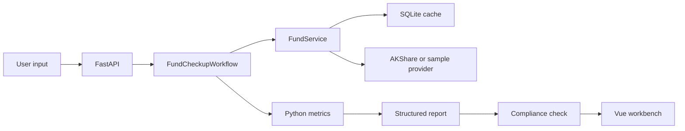

# Architecture

## Backend Layers

- `data_providers`: external data adapters. AKShare is the first real provider; sample provider supports offline demos.
- `storage`: SQLite cache for repeated fund profile and NAV calls.
- `metrics`: deterministic financial calculations.
- `reports`: structured report generation and conclusion classification.
- `compliance`: prohibited phrase scanning and safe wording enforcement.
- `agents`: workflow orchestration. V1 uses a LangGraph-compatible wrapper and can be expanded to real graph nodes later.
- `api`: FastAPI routes.

## Data Flow

## LLM Boundary

V1 does not require an online LLM to generate a useful report. This is intentional: the deterministic report is the reliable baseline.

Future LLM nodes may:

- classify intent,
- explain metrics in plainer language,
- summarize announcements,
- rewrite report tone,
- ask clarifying questions.

Future LLM nodes must not:

- calculate financial metrics,
- invent missing data,
- bypass compliance rules,
- produce buy/sell instructions.

## Failure Handling

- External provider failure falls back to sample provider when possible.
- Unknown fund code returns a degraded report or clear API error.
- Insufficient NAV history returns `数据不足，暂不评价`.
- Compliance issues are rewritten and recorded in report warnings.

