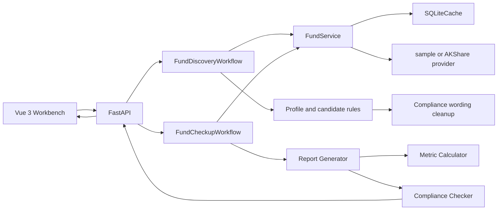
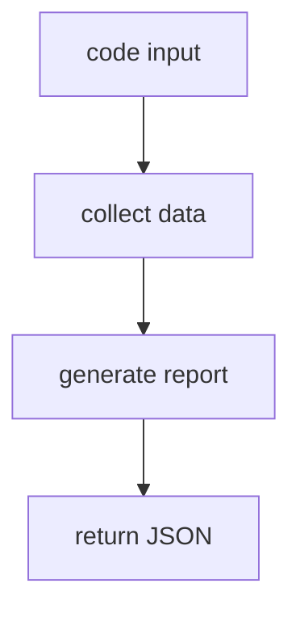
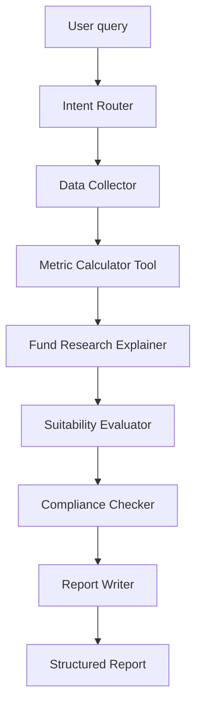
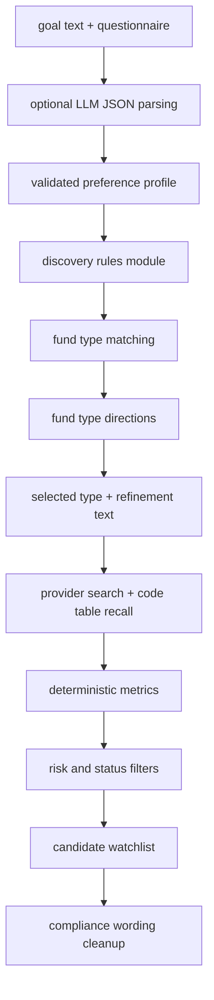

# Architecture

This document describes the current FundScope Agent architecture and the planned extensions for LangGraph, RAG, Memory, and SSE.

## Current System Overview



Current behavior:

- Frontend calls REST APIs.
- `FundDiscoveryWorkflow` turns user goals and questionnaire answers into a risk preference profile, matched fund categories, and optional refined candidates.
- Backend uses `FundService` to load profile, NAV, holdings, industry allocation, and fees.
- `FundCheckupWorkflow` collects profile, NAV, holdings, industry allocation, and fees concurrently to reduce AKShare wait time.
- `FundService` uses provider-specific cache keys to avoid mixing sample and AKShare data.
- `generate_fund_checkup_report` calculates metrics and assembles a report with holding and industry notes.
- `enforce_report_compliance` normalizes conclusion wording and appends the required disclaimer.

## Frontend Architecture

Current files:

- `frontend/src/App.vue`: single-page workbench.
- `frontend/src/api.ts`: API client and TypeScript response types.
- `frontend/src/styles.css`: app-level styling.

Current UI:

- left workflow rail,
- top product header and compliance status,
- separate discovery module with guided risk questions, category directions, and optional candidate refinement,
- fund input form,
- visual progress bar and stage list during report generation,
- fund profile strip,
- four metric cards,
- NAV, cumulative return, and drawdown charts,
- right-side structured report panel.
- clickable left rail that focuses search or switches the report panel tab.

Frontend state is local to `App.vue`. This is acceptable for V1 because the app has one main workflow. When multi-fund comparison, watchlists, or user risk profiles are added, state should be split by feature module before adding a global store.

## Backend Module Boundaries

```text
backend/app/api.py
```

FastAPI route layer. It should validate requests, call services/workflows, and return JSON. It should not calculate metrics or access external providers directly.

```text
backend/app/services/fund_service.py
```

Coordinates provider access and SQLite cache. It owns fallback behavior and cache namespace selection.

```text
backend/app/data_providers/
```

Provider adapters implement `FundDataProvider`:

- `SampleFundDataProvider`: deterministic offline demo data.
- `AkshareFundDataProvider`: default live AKShare adapter.
- `SampleFundDataProvider`: offline fallback and test/demo provider.

Future providers such as Tushare should implement the same interface and map external fields into internal DTOs.

```text
backend/app/metrics/calculator.py
```

Pure deterministic calculations. This module is the source of truth for financial metrics.

```text
backend/app/reports/generator.py
```

Combines profile, NAV, metrics, conclusion classification, data notes, and suitability language.

```text
backend/app/compliance/checker.py
```

Scans and rewrites prohibited phrases, enforces allowed conclusions, and appends the mandatory disclaimer.

```text
backend/app/agents/fund_checkup_graph.py
```

Current workflow wrapper. It is intentionally simple and LangGraph-compatible, but not yet a real graph with explicit nodes.

```text
backend/app/agents/fund_discovery.py
```

Pre-checkup discovery workflow. It builds an `InvestorPreferenceProfile`, maps it to fund types, searches provider candidates, calculates risk metrics, filters by deterministic risk thresholds, and returns up to 3 candidate funds for further checkup analysis. It must not return buy/sell advice.

## Provider Data Source Design

Provider interface:

- `search_funds(query) -> List[FundProfile]`
- `get_profile(code) -> FundProfile`
- `get_nav_history(code) -> List[NavPoint]`
- `get_holdings(code) -> List[FundHolding]`
- `get_industry_allocation(code) -> List[IndustryAllocation]`
- `get_fees(code) -> List[FundFee]`

Internal DTOs:

- `FundProfile`
- `NavPoint`
- `RiskMetrics`
- `DrawdownPoint`
- `FundHolding`
- `IndustryAllocation`
- `FundFee`

Rules:

- External provider field names must not leak into report generation or frontend code.
- Missing external fields should map to explicit placeholders such as `待补充` or produce warnings.
- Current MVP falls back to sample data when AKShare fails. Production mode should instead return an explicit degraded state.
- Cache keys must include provider namespace, for example `sample:profile:110011` or `akshare:nav:110011`.

## LangGraph Agent Workflow

Current implementation is a linear wrapper:



Planned LangGraph nodes:



Node responsibilities:

- Intent Router: classify single-fund checkup, comparison, portfolio analysis, or knowledge question.
- Data Collector: call providers and cache, return typed data and warnings.
- Metric Calculator Tool: call deterministic Python metrics only.
- Fund Research Explainer: explain metric meaning and risk signals.
- Suitability Evaluator: combine risk profile and fund risk signals when user profile exists.
- Compliance Checker: enforce prohibited wording and conclusion whitelist.
- Report Writer: produce structured report fields, not free-form investment advice.

Termination condition:

- A report is returned when data collection, metrics, and compliance checks complete.
- If required data is missing, return a degraded report with `数据不足，暂不评价`.

## Fund Discovery Workflow

Implemented endpoint:

```text
POST /api/fund-discovery
```

Purpose:

- help users who do not know a fund code first choose a fund category direction,
- keep the candidate output as a precursor to the existing single-fund checkup,
- avoid turning the project into a fund sales or direct recommendation system.

Current flow:



Rules:

- Risk thresholds, fund type mappings, search keywords, name keywords, seed fund codes, and recall limits live in `backend/app/agents/discovery_rules.py`.
- Natural language can be parsed by the configured text LLM into a small JSON profile. If the model is unavailable or returns invalid JSON, the workflow falls back to deterministic keyword heuristics.
- LLM output is used only as profile hints. Fund type matching, candidate recall, metric calculation, filtering, ranking, and compliance cleanup remain deterministic.
- `include_candidates=false` returns only fund type directions; `include_candidates=true` refines a selected direction into candidates.
- Candidate recall combines fund type search keywords, name keywords, curated seed codes, and provider code-table scanning before deterministic filtering.
- Candidate filtering uses deterministic code: fund type match, NAV sample length, volatility, maximum drawdown, and purchase status.
- Output labels use `候选观察` and `可进一步研究`, not direct recommendations.
- Each candidate links back to the existing fund checkup flow through its code.

## Metric Calculation Module

Implemented metrics:

- total return,
- annualized return,
- annualized volatility,
- maximum drawdown,
- drawdown start/trough/recovery days,
- Sharpe ratio,
- Calmar ratio,
- win rate,
- period returns: 1m, 3m, 6m, 1y, 3y.

Inputs:

- ordered or unordered `NavPoint` values.

Behavior:

- non-positive accumulated NAV values are ignored,
- fewer than two valid NAV points returns `None` metrics and a warning,
- fewer than 252 observations returns annualization warning,
- zero denominator ratios return `None`.

LLMs must not replace this module.

## RAG Module Design

Not implemented yet.

Planned purpose:

- parse fund announcements,
- summarize quarterly or annual reports,
- extract manager views,
- identify holding or strategy changes,
- cite source documents in research reports.

Planned components:

- document ingestion service,
- PDF/text extraction,
- chunking and metadata,
- embedding index or FTS index,
- retrieval API,
- citation-aware report explanation node.

RAG output rules:

- Always show source title/date when used.
- Do not treat manager outlook as guaranteed future performance.
- If source quality is poor, surface a data note instead of summarizing aggressively.

## Memory Module Design

Not implemented yet.

Planned memory types:

- user risk profile,
- watched funds,
- previously analyzed funds,
- user-stated investment horizon,
- user-held portfolio for overlap analysis.

Rules:

- User financial preferences should be explicit and editable.
- Do not infer sensitive profile fields without user confirmation.
- Memory should influence suitability wording, not produce buy/sell instructions.
- Memory storage must be separated from provider cache.

## SSE Realtime Output Design

Not implemented yet.

Planned endpoint:

```text
POST /api/reports/fund-checkup/stream
```

Planned event sequence:

- `started`
- `data_collecting`
- `data_collected`
- `metrics_calculating`
- `metrics_calculated`
- `report_writing`
- `compliance_checking`
- `completed`
- `failed`

Example event payload:

```json
{
  "event": "metrics_calculated",
  "message": "已完成最大回撤、波动率和夏普比率计算",
  "progress": 0.65
}
```

SSE should stream progress and final report, not partial unreviewed investment suggestions.

## Bailian LLM Service

Implemented endpoint:

```text
GET /api/llm/health
```

Purpose:

- test whether the configured Bailian OpenAI-compatible endpoint can reach `qwen3.6-plus`,
- return a safe connection status to the frontend,
- avoid exposing API keys or private endpoint values.

Required environment variables:

- `DASHSCOPE_API_KEY`
- `DASHSCOPE_BASE_URL`
- `DASHSCOPE_MODEL`, defaults to `qwen3.6-plus`

Current usage:

- service connectivity test only.

Not yet implemented:

- LLM-generated report commentary,
- streaming report generation,
- prompt versioning.

## Failure Handling

- Unknown code in sample mode returns provider errors through workflow degradation.
- External provider failure falls back to sample provider in current local MVP.
- Insufficient NAV history returns `数据不足，暂不评价`.
- Compliance checker rewrites unsafe wording and records a warning.
- API route errors should use clear HTTP status codes when the workflow cannot produce a report.

## Documentation Coupling

When architecture changes:

- update this file,
- update `docs/API.md` if endpoints change,
- update `docs/PROJECT_STATUS.md` with the latest implementation state,
- update `AGENTS.md` if maintenance rules change.
