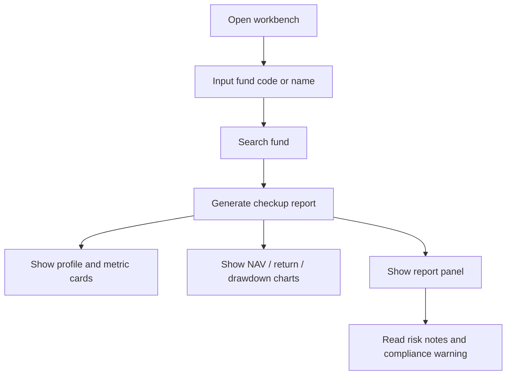

# PRD: FundScope Agent

## Product Positioning

FundScope Agent is a fund research and risk analysis assistant for ordinary investors. It explains historical fund performance, risk, and suitability signals in a structured way.

The product should help users understand a fund. It must not directly tell users to buy or sell.

## Target Users

- 普通基金投资者：希望看懂基金风险，不只看排行榜。
- 投资新手：不知道最大回撤、波动率、夏普比率意味着什么。
- 有多只基金关注对象的用户：想把基金放进观察池持续比较。
- 面试官/评审者：关注项目是否体现真实业务拆解、Agent 架构、金融指标计算和合规意识。

## User Pain Points

- 只看短期涨幅，无法判断收益来源和风险。
- 不知道历史最大亏损可能有多深。
- 看不懂专业指标。
- 不知道基金是否适合自己的风险承受能力。
- 很多 AI 工具容易直接输出“推荐买入”，合规风险高。
- 数据源不稳定时，演示项目容易不可用。

## Core Scenarios

### Scenario 1: 单只基金体检

用户输入基金代码 `110011`，系统返回：

- 基金基础档案，
- 净值走势，
- 累计收益走势，
- 回撤走势，
- 核心风险收益指标，
- 主要风险提示，
- 适合人群和不适合人群，
- 合规免责声明。

### Scenario 2: 风险解释

用户看到“最大回撤 -49%”时，系统解释该信号意味着历史上可能出现较深净值回撤，不适合无法承受较大波动的保守型用户。

### Scenario 3: 演示稳定性

面试或本地演示时，默认 sample provider 不依赖外部网络数据源。需要真实数据探索时，再显式启用 AKShare。

## MVP Functional Requirements

Implemented in current MVP:

- Fund search API.
- Fund profile API.
- Fund NAV API.
- Fund checkup report API.
- Deterministic metrics calculation.
- Report conclusion classification.
- Compliance phrase checking.
- Vue workbench with charts and structured report.
- Local cache.
- AKShare real data provider with sample fallback.
- Bailian model connection test.

## MVP Non-Goals

The current MVP does not include:

- buy/sell/hold recommendations,
- fund sales or trading,
- user account system,
- real user risk questionnaire,
- portfolio analysis,
- multi-fund comparison,
- holdings overlap,
- fund manager attribution,
- announcement RAG,
- long-term user memory,
- SSE streaming progress.
- LLM-generated report narrative.

These may be added later, but only with explicit compliance boundaries.

## Page Flow

## Report Decision Rules

Current report conclusion is selected from a whitelist:

- `适合关注`
- `适合长期观察`
- `仅适合高风险用户`
- `不适合当前用户`
- `数据不足，暂不评价`

Current classification signals:

- insufficient data -> `数据不足，暂不评价`,
- max drawdown <= -35% -> `仅适合高风险用户`,
- annualized volatility > 32% -> `仅适合高风险用户`,
- max drawdown >= -12% -> `适合长期观察`,
- otherwise -> `适合关注`.

These thresholds are MVP heuristics and must be documented if changed.

## Risk Boundaries

- Do not promise future performance.
- Do not imply guaranteed return.
- Do not say a fund is suitable for a specific user unless a user risk profile exists.
- Do not hide data limitations.
- Do not use sample data as if it were live market data.
- Do not commercialize AKShare-backed data without replacing the data source and reviewing licenses.

## Success Criteria

MVP is successful when:

- A user can input `110011` and receive a structured report.
- Metrics are calculated by Python code.
- Frontend charts render from API data.
- Report contains risk notes and disclaimer.
- Tests pass.
- Documentation explains what is implemented and what is planned.
